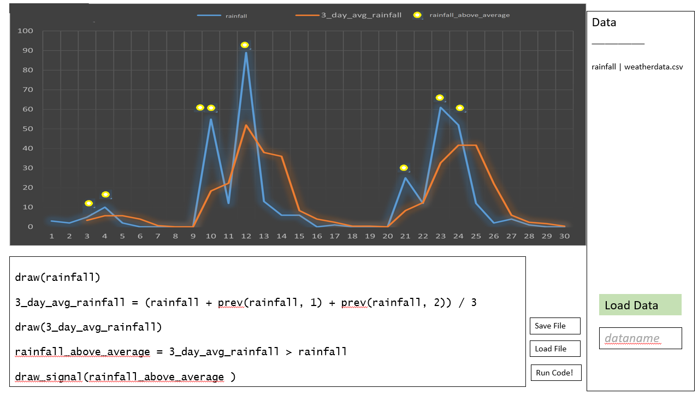

# Array Programming Language for Charting Data

*Thomas Shaer- 1905941*

#### Project Idea
My idea for my project is to build a simple array programming language that is designed for charting data. A chart will exist within the tool, and the user can write code to display certain plots on the chart. The language and chart will both be integrated into a single tool for convenience. Additionally, the user can input array data into the tool via excel files, csv etc., which can be charted with the language. The applications for such a tool would be mainly research and education.

#### Milestones

I have created three major milestones for my project. The first milestone is getting all the basic features of the program working, which includes a working language, integrated chart and a GUI. These are the essential components of the project, without them, the user would not be able to create and view the mathematical models that the project is supposed to do. Since some of these major components are built on top of each other, for example it would not be possible to display a chart without a basic GUI, the “sub-milestones” are ordered in such a way to reflect this dependency hierarchy - for example build a basic GUI first, then integrate a chart. Additionally, I have opted to build what I predict to be the most time-consuming yet essential components first, such that if I have time issues towards the end of the project, I will be reassured in knowing that the most essential ones have already been delivered.  

The first major milestone will likely take the largest amount of time to complete as it promises to deliver the basic functionality of the application. Thus, once that has been completed, the rest of the time spent working on the project will be related to adding polish/new features to the program. This time is split up into two further milestones. The first of which, milestone 2 is related to enhancing the user experience with “quality of life” improvements. These improvements will be non-essential but if implemented would greatly enhance the software. The order of these sub milestones won’t matter as much since they are independent of each other. Milestone 3 can be seen as the polish stage. Like milestone 2, these features are non-essential but would make the software seem more professional. I do not expect to achieve all the features detailed in milestone 2 and 3 but I would like to achieve as many of them as possible.    

**Milestone 1**

Finish a working prototype with all basic components implemented. 

*Planned time of completion: between week 10-13*
1.	Basic version of the language with following features implemented:
a.	Float/Boolean/null type
b.	Built In Methods
c.	Arithmetic/Comparison
d.	Ability to output data that can be rendered by a chart
2.	Get basic GUI framework going for interaction with the program
a.	Basic integration of language into the GUI
3.	Basic chart working that can display output information from the language.
4.	Basic input and labelling for user submitted data so that it can be used and referenced in the language.

**Milestone 2**

Add extra features that make the software more convenient for the user to use. These items are not required but enhance the product greatly.

*Planned time of completion: between week 13-18*

- Interface for saving/loading code to and from the user’s file system
- Ability for user to export chart data from the program
- Additional built in functions supporting a common basic mathematical operations such as regressions, stochastics etc.
- If required, more sophisticated methods of loading in data from CSVs, e.g. tables of data, different file types etc.
- Testing the application for system compatibility on different OS's

**Milestone 3**

Add features that add to a sense of “polish” for the software. These features will range in difficulty and its likely that I will not be able to implement all of them. However implementing them would significantly enhance the program.

*Planned time of completion: between week 18-22*

- Intellisense/autocomplete for writing code
- More language features such as if statements or user defined functions
- Ability to spawn and plot on multiple different charts
- Ability to save a chart to disk as a PNG or JPEG
