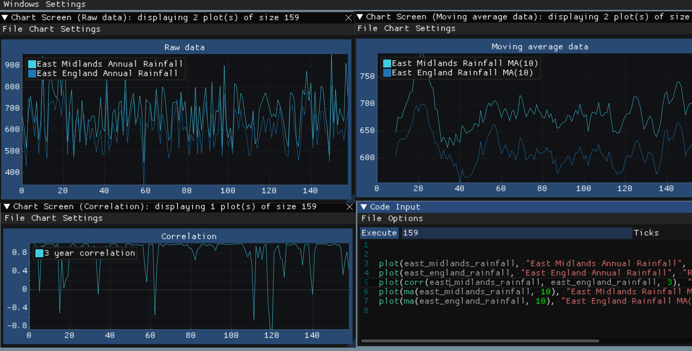
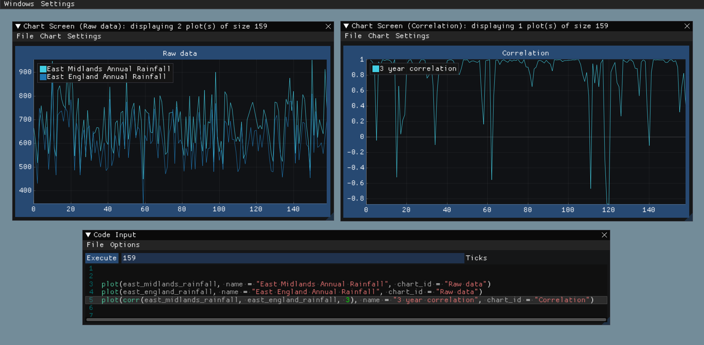

# Array Programming Language & IDE for Charting Data

This project aims to create an all-in-one software for programmatically creating charts via a custom-built programming language, designed specifically to provide an alternative to Excels chart building features. The programming language is an array language, a paradigm where computations apply to entire arrays at once, often in parallel, which is necessary for charting since chart data is in the form of data series that can be interpreted as an array. 

The software is delivered in the form of an IDE (Integrated Development Environment), which allows the user to write and test code. Although the software utilises a programming language, one of the primary aims of the project is to keep the language as beginner-friendly as possible such that it is accessible to non-technical users. Additionally, since the project is aiming to act as a replacement for Excels chart building features, another important aspect is compatibility with Excel. To act as an effective replacement, it is essential that the user can import and export data to and from Excel, and several IDE features allow the software to do so.

**A full summary, breakdown, language and IDE documentation and instructions can be found in *Final Report.pdf* as well as the original project proposal in *"Initial Proposal.pdf"*. Setup instructions can also be found in *"Setup.pdf"*** 

## Install (full version in Setup.pdf)

### Executable
I’ve also packaged a binary (.exe) version of the software in this zip called “Executable”. If you want to run the software without compiling it, you can simply extract this folder from the zip, and execute “Thomas_Shaer_Dissertation.exe”. You can also run the tests by executing “Tests.exe”. I also give a sample code file called "tradingdemo.al" in the Example Code directory. This is the same example seen in the main report under “backtesting case study”. I have also included the EURUSD.csv data that is required for this script in the Example Data directory.

### Setup
#### Requirements

 - Visual Studio 2019 v.16.8.4
 - Microsoft .NET framework v.4.8.04161
 - Windows 10/11

The software is setup to run on 32bit machines therefore any Windows 10/11 OS should support it. The project may work with slightly different versions of Visual Studio and .NET framework but above is what it was created with.

#### Steps (main software)

 1. Double click the “CodeBase.sln” file.
 2. This will open the project in Visual Studio 2019. Locate and open the “Solution Explorer” tab if not already present. You should see two projects: CodeBase and Tests.
 3. The CodeBase project contains the actual code for the software, while the Tests project contains the code for testing the software.
 4. It is recommended that you first run the CodeBase project as Tests is dependent on it.
 5. The GUI should open automatically. Note, if the windows look funny, they can be resized and opened from the main tool bar.

#### Steps (tests)
1. To run the tests, you should open the “Test Explorer” window.
2. By default, no tests might be detected. Press the green button on the top left of the text explorer window, which will find and run all the tests automatically. The Tests code will be recompiled the first time you run it (seen in the output window), so it might take a few minutes to run.

#### Additional Compiler Information

 - Windows SDK version: 10.0
 - Platform Toolset: Visual Studio 2019 (v142)
 - C++ Language Standard: Previous from the Latest C++ Working Draft (/std:c++latest)

## IDE Features

### Error Highlighting Feature

We provide error highlighting by performing static error checking on code as it is being written. This is achieved by executing only the parsing and semantic type-checking phases of the language. Using this feature, we can identify and warn users of some errors before they execute the code.

### Multiple Charts

The IDE can support multiple charts, meaning that the user can plot multiple charts from the same script. This can be incredibly useful for analysing different plots with substantial axis size differences, or just for spreading out the data to avoid a single chart becoming too complicated. This is also a non-functional requirement.

### Importing/Exporting of data
 

For the tool to act as an effective replacement for Excel’s charting features, it is essential that it can import and export data. This is also a functional requirement of the software. We use the Comma Separated Value (CSV) file format40 to support reading and writing data, which is a supported file format of Excel. We read and write in series of data which can either be done column-wise or rowwise. Each series maps back to a unique variable.

Inputting data into the language is done via parsing a CSV file, parsing each series of data found in it. The logic for parsing is slightly involved because it requires the data to follow several rules or else the program won’t be able to figure out what type of variable it should be. It also requires the parser to determine a type for the series of data. 

Once a series is successfully parsed, a VarSymbol object is created and loaded with the series data. This VarSymbol is loaded onto the global symbol table so that it is accessible to the language part of it. Exporting data is more straightforward as any data stored within a variable is guaranteed to be correct. We can convert the value of any of these types into a string representation that can be written to CSV.

## Language Features (full version can be found in appendix of Final Report.pdf)

### Types

The language is implemented as a statically typed language utilising type inference to assign types to variables. This means that once a variable is assigned a type, it cannot change. The type of the variable is inferred from the first expression that is assigned to it.

There are three main types of the language.

 1.  **Number** type. This type’s value is implemented in C++ as a float. We call it a number as opposed to a float to make it more understandable for non-technical persons. The number type is used to represent all numbers within the software.
 2.  **String** type. This type’s value is implemented in C++ as a std::string . The string type allows for text input into the program.
 3.  **Boolean** type. This type’s value is implemented in C++ as a bool. It is the truthy type of expressions.

In addition to these main types, there is support for constant types for string and number. Constant types are used to provide a semantic guarantee that the runtime value of a type will never change

### Supported Statements/Expressions

 - Assign/Declare
 - If statement
 - Method Call
 - Ternary Statement
 - Comment
 - Operators: Addition / Subtraction / Multiplication / Division / Modulus / Exponent / Logical Not / Less Than / Less Than or Equal / Greater Than / Greater Than or Equal / Equal / Not Equal / Logical And / Logical Or
 - Assign Operators: Addition / Subtraction / Multiplication / Division / Modulus / Exponent 

### Built-in methods

I have written an extensive standard library of methods containing 63 built-in methods. This library contains some essential methods such as output methods, but also many additional methods ranging from logical, mathematical, type casting and statistical methods. These methods and their descriptions can be found in the documentation window of the IDE. Additionally a full breakdown and description of every method can be found in the Report appendix.

## IDE Breakdown (full version in Setup.pdf)

#### Overview

1. Chart window – displays chart content, dynamically created depending on what the script plots to.
2. Code editor window – where the user inputs/manage their code files.
3. Program output window – output from the script is displayed here, including error messages, code reconstruction and user defined variables.
4. Documentation window – details of all registered built-in methods by category, are automatically display here.
5. Data manager window – where data is imported into the program and turned into language variables.
6. Main window toolbar – windows can be opened/closed from here and the global text size can be adjusted

#### Code Editor Window

1.  Text input – this is where the user writes the code.
2.  Number of ticks input – the user can select how many times they want the code to execute for (i.e., the size of internal arrays), by default this will revert to the maximum size of the largest inputted variable.
3.  Execute button – runs the code.
4.  Options menu – allows the user to toggle code highlighting.
5.  File menu – allows the user to create/load/save code files to/from disk.

#### Documentation Window

1.  Method category tabs – groups all methods via tabs, currently there is operators, mathematical, logic, output, statistics and miscellaneous.
2.  Signature of method – shows signature of method, including return type, name and parameter types.
3.  Method description – displays description of method.
4.  Method parameters – displays type and description of parameters.
5. Method return type – displays type and description of the return type.

#### Output Window

1.  Text output tab – displays any error messages after running the script.
2.  Code reconstruction tab – displays how the code is parsed and interpreted in AST form.
3.   Variables tab – displays information about all variables in script including export settings.
4.  Export data – takes user to export dialog after selecting some variables to export.
5.  Variables – lists all variables in program.
6.  Variable information – shows information about selected variable.

#### Data Manager Window

1.  File menu – allows users to import/remove all data files.
2.  Remove file – allows the user to select a data file to remove. Will remove all associated series/variables with the file.
3.  Series list – displays list of all parsed series from imported data files.
4.  Series information – displays information about selected series.
5.  Variable creation settings – allows the user to convert the series into a variable, including other management settings.

#### Chart Window

1.  File menu – contains settings for exporting chart as a PNG to disk.
2.  Chart menu – contains chart control settings, such as clearing the chart, rescaling axis, and ability to disable the key.
3.  Settings menu – contains setting for toggling chart anti-aliasing.
4.  Chart key – name to colour mapping for each plotted series – name of key is specified by optional “name” parameter of plot() and mark() functions (default is empty).
5.  Chart title – title of the chart – specified by optional “chart_id” parameter of plot(), mark() and text() functions (default is “main”).
6.  Contents of chart – interactable chart explorer.
